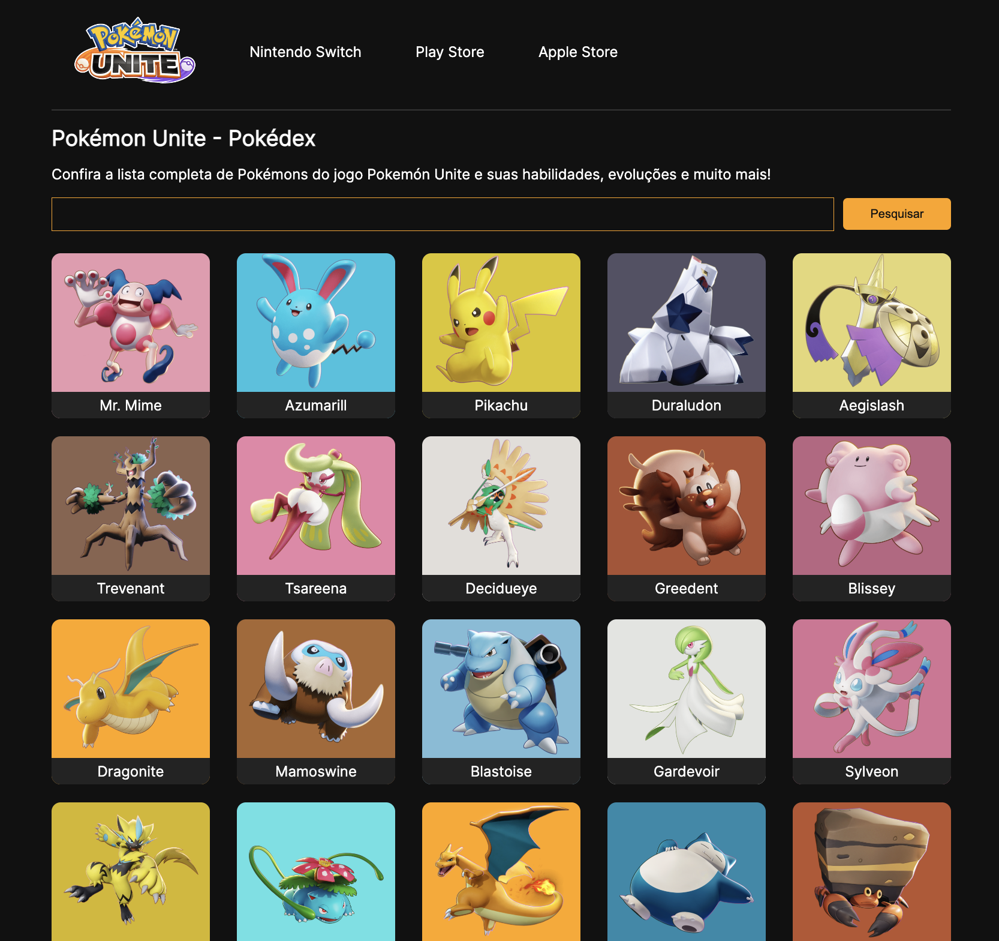
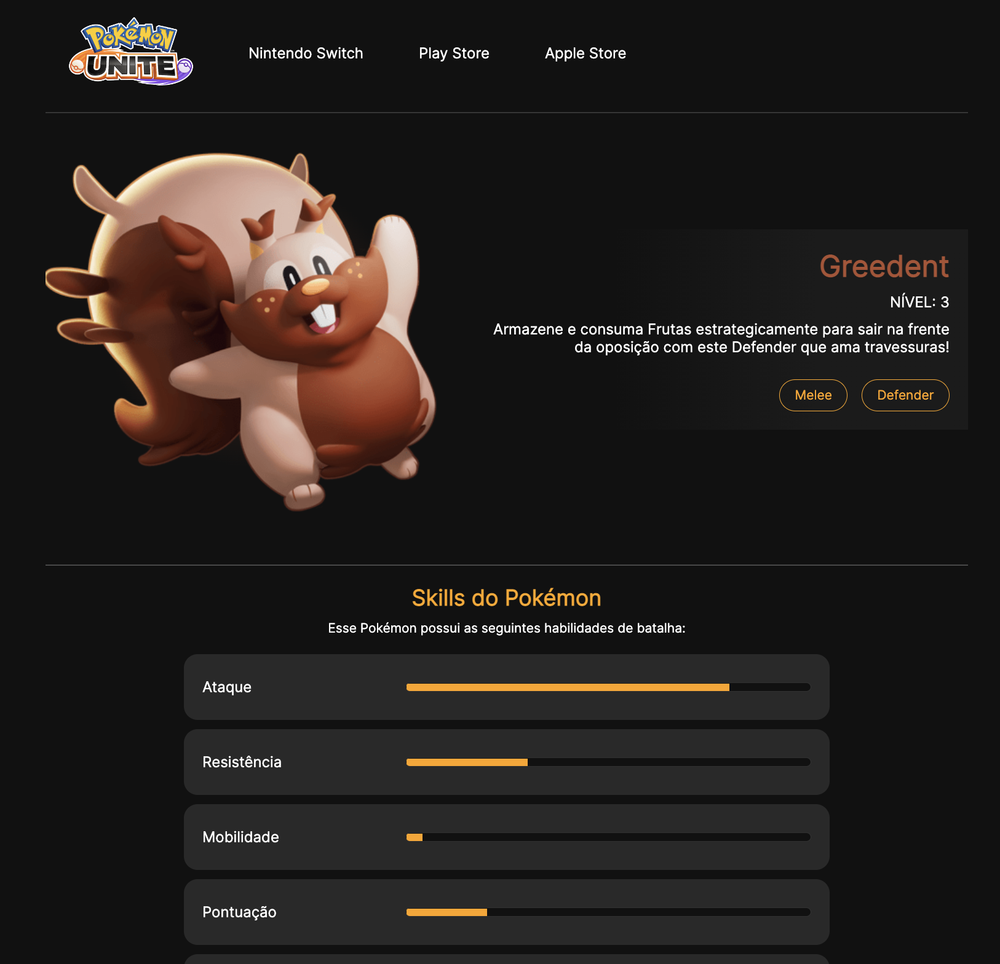
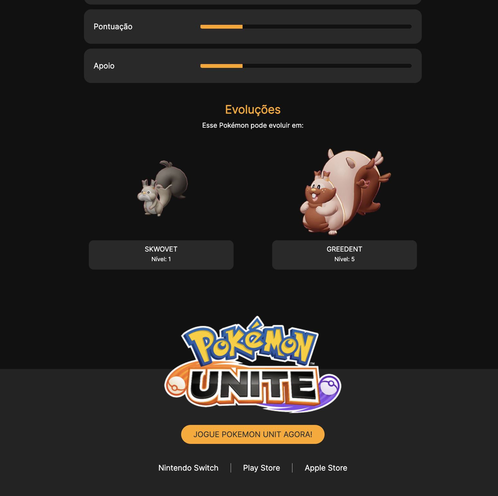

# Pokemon Unite

Projeto criado para fins de estudos do AngularJS. 

## Links úteis
- https://angular.io/
- https://www.figma.com/file/ewslOI0uVZFMN3M74W5BAB/Pok%C3%A9mon-Unite?node-id=52%3A2&t=CP19Ov30Du1S9XoV-1

## Para executar

- Baixe o repositório para a sua máquina
- Instale o Angular CLI: `npm install --global @angular/cli`
- Instale as dependencias do projeto utilizando o comando `npm install`
- Na pasta do repositório, execute o comando `ng serve -o`

## Sobre o desafio

Este desafio foi elaborado e criado pelas desenvolvedoras Michele Ambrosio e Dayane Moraes. Sigam nas redes sociais.

<table border=0 width="500">
  <tr>
      <td></td>
      <td>Michele Ambrosio Front-End Developer</td>
      <td>
      LinkedIn: https://www.linkedin.com/in/michelequeirozambrosio  
      Instagram: https://www.instagram.com/programi_  
      Github: https://github.com/micheleambrosio
      </td>
  </tr>
  <tr>
    <td></td>
    <td>Dayane Moraes Software Developer</td>
    <td>
      LinkedIn: https://www.linkedin.com/in/dayane-moraes  
      Instagram: https://www.instagram.com/daya_moraes_
      </td>
   </tr> 
  
</table>

## Screenshots

